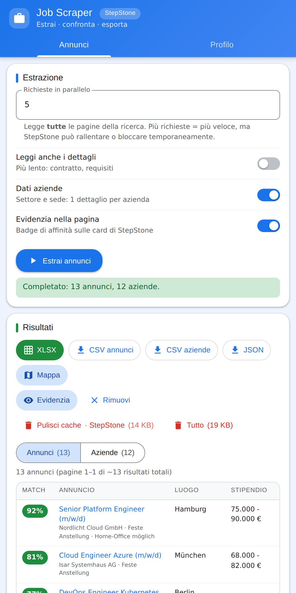
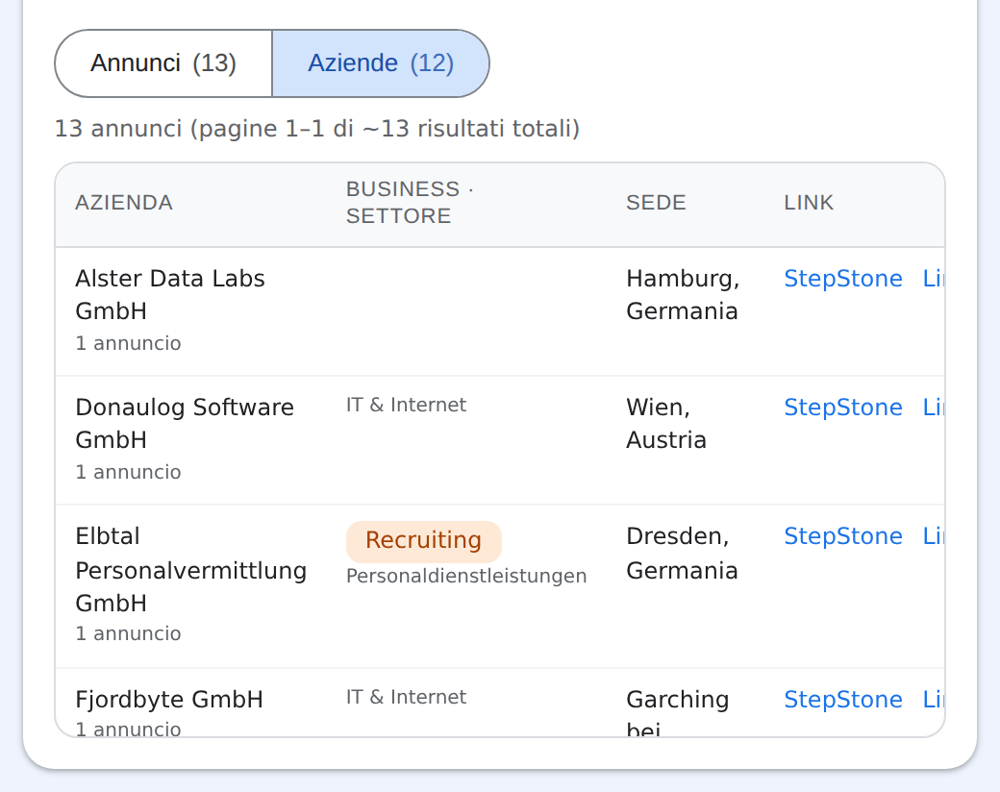
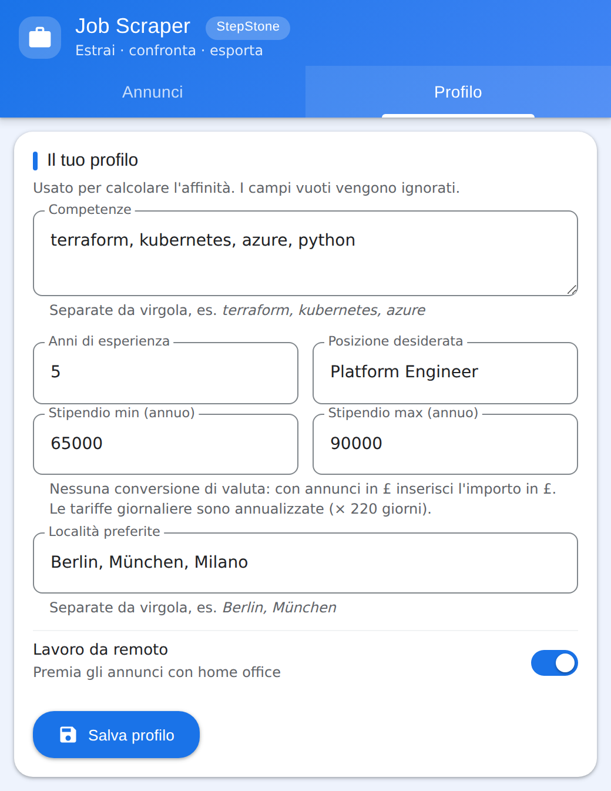
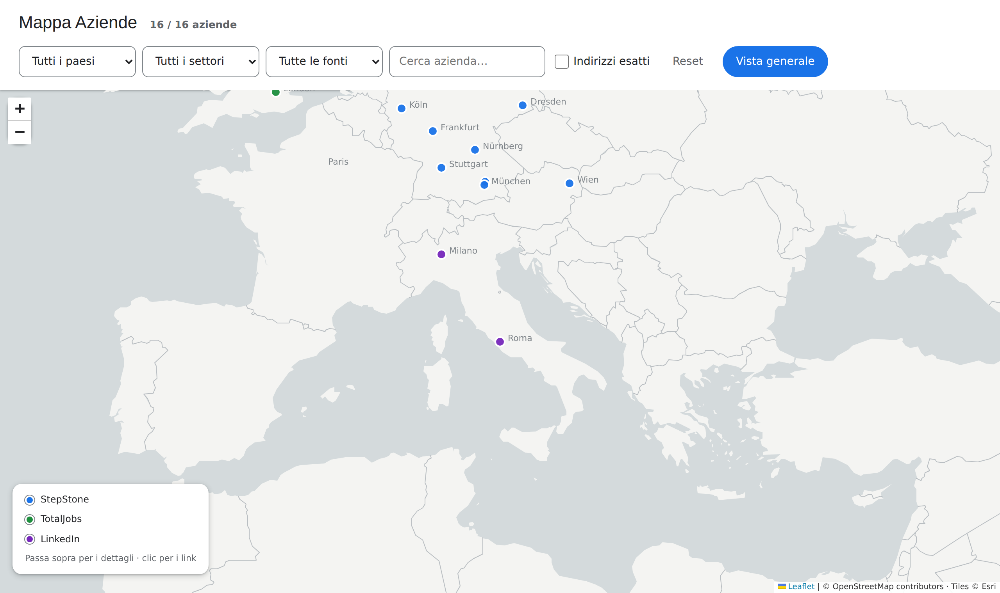
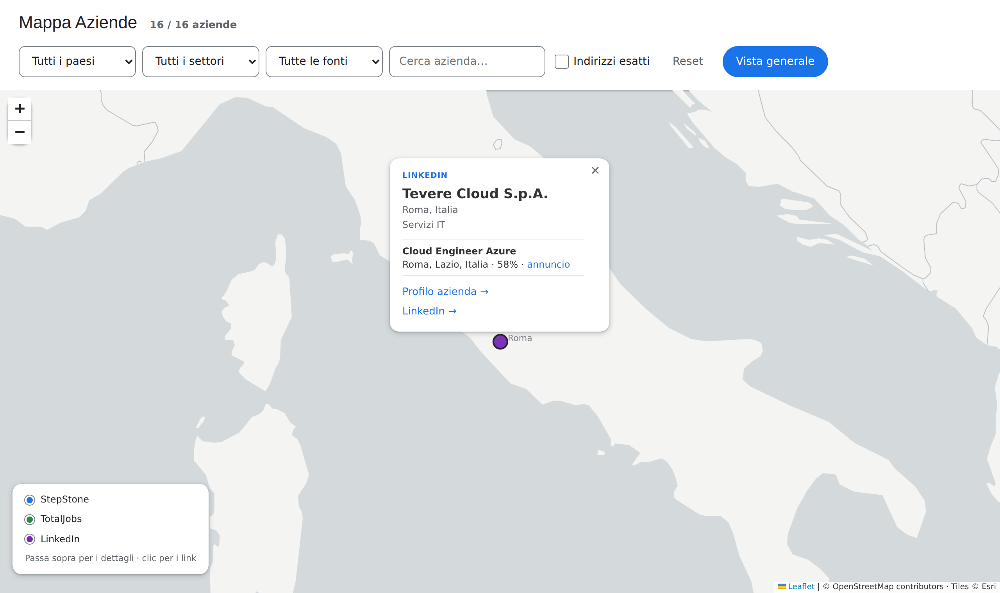

# Job Scraper & Matcher (StepStone · TotalJobs · LinkedIn)

Estensione Chrome (Manifest V3) che legge gli annunci di una **pagina di ricerca StepStone, TotalJobs o LinkedIn**, li confronta con il tuo **profilo** (skill, esperienza, posizione, stipendio, località) e assegna a ciascuno un **punteggio di affinità** da 0 a 100. Dagli stessi risultati ricava anche la **lista delle aziende**, la mostra su una **mappa** e permette di esportare tutto in **XLSX**, CSV e JSON.

Siti supportati:

| Sito | Domini | Valuta | Note |
| --- | --- | --- | --- |
| **StepStone** | `www.stepstone.de`, `.at`, `.be`, `.nl`, `.fr` | EUR | Profilo azienda `/cmp/…`, stipendi spesso stimati. |
| **TotalJobs** | `www.totaljobs.com` | GBP | Stesso design system (`data-at`), stipendio in `job-item-salary-info`, spesso come tariffa giornaliera; ID azienda in `?cmpId=`. |
| **LinkedIn** | `www.linkedin.com` | dal testo | Lettura **guidata** (scorre la lista e clicca «Avanti»), ritmo ridotto, max 40 pagine. Vedi la sezione LinkedIn qui sotto. |

<p align="center">
  
  
  
</p>



<sub>Screenshot generati con dati dimostrativi (aziende inventate) e uno sfondo semplificato al posto delle tessere Esri: vedi [Aggiornare gli screenshot](#aggiornare-gli-screenshot).</sub>

Il sito è riconosciuto dall'host della scheda attiva; i risultati sono salvati **per sito** (estrarre su TotalJobs non cancella quelli di StepStone) e il popup mostra il sito corrente in un'etichetta accanto al titolo.

```txt
extension/
├── manifest.json     Configurazione MV3, permessi, content script
├── selectors.js      Selettori CSS di base, condivisi tra i siti
├── sites.js          ★ Registro dei siti: host, valuta, estrattori di ID, differenze di selettori per sito
├── content.js        Estrazione dal DOM, paginazione, arricchimento, badge in pagina
├── match.js          Parsing stipendio e calcolo del punteggio (condiviso con il popup)
├── companies.js      Lista aziende: raggruppamento, classificazione Main Business, link LinkedIn
├── xlsx.js           Writer XLSX minimale, senza dipendenze esterne
├── background.js     Service worker: default, verifica tab/dominio, iniezione content script
├── popup.html/.css/.js   Interfaccia: profilo, avvio scraping, tabella, export
├── content.css       Stile dei badge nella pagina
├── map.html/.css/.js     Pagina «Mappa aziende»: filtri, marker, scheda dell'azienda
├── geo.js            Coordinate da tabella locale, alias delle città, unione delle aziende tra siti
├── cities.json       Tabella città/paese → coordinate (nessuna geocodifica in rete)
├── vendor/leaflet/   Leaflet 1.9.4 (BSD-2-Clause), incluso: MV3 non ammette script remoti
└── test/             Test dei parser sulle pagine HTML salvate nel repo
docs/
├── screenshots/      Immagini usate in questo README
└── tools/            Script Playwright che le rigenera (dati dimostrativi)
```

### LinkedIn: come funziona e cosa è verificato

- **Dove**: apri *Lavoro* e fai una ricerca (`/jobs/search/` o `/jobs/search-results/`), attendi che compaia la lista e premi *Estrai annunci*. Su una pagina di singolo annuncio o sulla home l'estrazione è rifiutata.
- **Lettura guidata**: LinkedIn non usa `?page=N` e carica le card solo quando sono visibili, quindi l'estensione non scarica le altre pagine ma **fa quello che faresti tu**: scorre la lista, legge le card, clicca «Avanti», attende che la lista cambi e ripete. Parte dalla pagina aperta e va solo avanti. **Tieni la scheda aperta sulla ricerca** e non cambiare pagina durante l'estrazione; *Ferma* interrompe mantenendo quanto già raccolto.
- **Ritmo ridotto**: una pagina alla volta con pause di 1,5–3,5 s, al massimo 2 richieste in parallelo per dettagli e dati azienda, tetto di 40 pagine (LinkedIn mostra al massimo circa 1000 risultati).
- **Dettagli e dati azienda**: come sugli altri siti si scarica `/jobs/view/<id>/` (descrizione, contratto, modalità; settore e dimensione dell'azienda; link al profilo LinkedIn dell'azienda, usato anche nella colonna *LinkedIn*). Il paese viene dall'ultima parte del luogo («Roma, Lazio, Italia» → *Italia*).
- **Rischio account**: sei autenticato col tuo profilo e i termini di LinkedIn vietano l'estrazione automatica; l'account potrebbe essere limitato. Usalo con moderazione, su ricerche piccole, a tuo rischio.
- **Stato della verifica**: dettaglio e lista dell'interfaccia `/jobs/search/` sono verificati su pagine salvate reali (`linkedin-job-detail-page.html`, `linkedin-result-frame.html`: titolo, azienda, luogo, modalità, data, ID, totale risultati, «Pagina N di M» e pulsante «Avanti»). La lista sta in un iframe (`interop-iframe`, stessa origine): l'estensione lo legge da sola. **Non verificata** la variante `/jobs/search-results/` (interfaccia diversa): se compare l'avviso *Nessuna card trovata*, aggiorna la voce `linkedin` in `extension/sites.js`.
- **Card non ancora caricate**: LinkedIn disegna il contenuto di una card solo quando è visibile (fuori schermo è un segnaposto vuoto). L'estensione scorre la lista finché sono piene; se alcune restano vuote vengono ignorate con un avviso, non esportate come righe vuote.
- **Pulsante «Avanti»**: si usa solo quello della paginazione («Visualizza pagina successiva»). Nel pannello di dettaglio esistono altri pulsanti con «Avanti» (es. le foto dell'azienda) che non vengono mai cliccati.
- **Aggiornare le pagine di esempio**: sulla pagina di ricerca apri la console (F12) ed esegui `copy(document.querySelector('iframe[data-testid="interop-iframe"]').contentDocument.documentElement.outerHTML)`, poi incolla in `example/linkedin-result-frame.html`. `linkedin.test.js` lo usa per verificare le card reali.

---

## 1. Installazione (modalità sviluppatore)

1. Apri Chrome e vai su `chrome://extensions`.
2. Attiva **Modalità sviluppatore** (interruttore in alto a destra).
3. Clicca **Carica estensione non pacchettizzata**.
4. Seleziona la cartella **`extension/`** di questo repository (quella che contiene `manifest.json`).
5. (Consigliato) Clicca l'icona a forma di puzzle nella barra di Chrome e **fissa** l'estensione.

Dopo ogni modifica al codice, premi l'icona ↻ sulla scheda dell'estensione in `chrome://extensions` e **ricarica la pagina** (F5).

## 2. Primo utilizzo

### a) Compila il profilo

Apri il popup → scheda **Profilo**:

| Campo | Esempio | Note |
| --- | --- | --- |
| Competenze | `terraform, kubernetes, azure` | Separate da virgola. Cerca ogni skill in titolo, anteprima, descrizione e requisiti. |
| Anni di esperienza | `5` | Confrontato con "N Jahre/years" nei requisiti (solo con *Leggi anche i dettagli*). |
| Posizione desiderata | `Platform Engineer` | Confrontata con il titolo dell'annuncio. |
| Stipendio min/max | `60000` / `90000` | Importo annuo, **senza conversione di valuta**: con annunci in £ (TotalJobs) inserisci l'importo in £. Usato solo per annunci che indicano uno stipendio. |
| Località preferite | `Berlin, München` | Separate da virgola. |
| Remoto | ☑ | Premia gli annunci con "Home-Office". |

Premi **Salva profilo**. Tutto viene salvato in `chrome.storage.local` (solo sul tuo browser). I campi lasciati vuoti **non penalizzano**: vengono semplicemente ignorati nel calcolo.

### b) Estrai gli annunci

1. Su StepStone esegui una ricerca e imposta i filtri che vuoi (parola chiave, luogo, tipo di lavoro, stipendio…). L'estensione usa **l'URL corrente**, quindi tutti i filtri attivi vengono mantenuti.
2. Apri il popup → scheda **Annunci**.
3. Imposta:
   - **Richieste in parallelo** (1–10, default 5): l'estensione legge **sempre tutte le pagine** della ricerca corrente (una pagina ≈ 25 annunci, anche oltre le 20 pagine) scaricandole in parallelo. Più richieste = più veloce, ma StepStone può rallentare o bloccare temporaneamente. Se ottieni errori, abbassa il valore. Le ricerche molto ampie, soprattutto con *Leggi anche i dettagli*, possono richiedere diversi minuti: **Ferma** interrompe mantenendo quanto già raccolto.
   - **Leggi anche i dettagli**: apre in background ogni annuncio per ottenere tipo di contratto, modalità di lavoro, descrizione e requisiti. Più preciso, ma molto più lento (≈ 1–2 s per annuncio).
   - **Dati aziende**: per ogni azienda scarica **un solo** annuncio di dettaglio e ne ricava settore, sede e paese (vedi sezione 4). Attivo di default.
   - **Evidenzia l'affinità nella pagina**: aggiunge un badge colorato alle card della pagina corrente.
4. Premi **Estrai annunci**. Barra di progresso e stato sono visibili nel popup; puoi chiuderlo: l'operazione continua e i risultati restano salvati. **Ferma** interrompe mantenendo quanto già raccolto.

### c) Leggi i risultati

- La tabella è ordinata per **affinità decrescente**; il titolo apre l'annuncio in una nuova scheda.
- **Evidenzia in pagina / Rimuovi**: mostra o toglie i badge (verde ≥ 70, giallo 40–69, grigio < 40).
- Se modifichi il profilo, i punteggi vengono **ricalcolati subito** sui risultati già estratti, senza rifare lo scraping.
- Le viste **Annunci** e **Aziende** sopra la tabella alternano le due liste.
- **Export**:
  - **XLSX**: un unico file con due fogli, **Aziende** e **Annunci** (intestazione in grassetto, riga bloccata, filtro automatico, link cliccabili).
  - **CSV annunci** / **CSV aziende** (separatore `;` con BOM, si aprono correttamente in Excel italiano/tedesco).
  - **JSON**: tutti i dati (annunci, aziende, metadati).
- **Mappa**: apre in una nuova scheda la mappa delle aziende di tutti i siti estratti (vedi [Mappa aziende](#4b-mappa-aziende)).
- **Pulisci cache**: elimina gli annunci e le aziende estratti e lo stato salvato (accanto al pulsante è indicata la dimensione occupata) e rimuove i badge dalla pagina. Agisce sul **sito mostrato** (il nome è accanto al pulsante); **Tutto** svuota la cache di tutti i siti. **Profilo e opzioni non vengono toccati.** Chiede conferma ed è disattivato mentre uno scraping è in corso. Utile prima di una nuova ricerca, per liberare spazio o dopo un aggiornamento dell'estensione.

## 3. Come viene calcolato il punteggio

Media pesata dei soli criteri applicabili:

| Criterio | Peso | Punteggio |
| --- | --- | --- |
| Skill | 50 | skill trovate / skill del profilo |
| Posizione | 20 | 1 se il titolo contiene la frase; altrimenti quota di parole trovate |
| Stipendio | 10 | 1 se il range offerto raggiunge il minimo desiderato, altrimenti proporzionale (stipendio stimato per mesi/ore → annualizzato) |
| Località / remoto | 10 | 1 se il luogo corrisponde a una preferenza, o l'annuncio offre home office e lo desideri |
| Esperienza | 10 | `min(1, i tuoi anni / anni richiesti)` — solo se l'annuncio indica gli anni |

Un criterio senza dati (profilo o annuncio) è escluso, non conta come zero. Senza nessun criterio applicabile il punteggio è `–`. I pesi sono in `match.js` (`WEIGHTS`).

Nota: gli stipendi mostrati da StepStone sono spesso **stime** ("geschätzt für Vollzeit"), non dati dichiarati dall'azienda.

**Valuta e tariffe giornaliere.** Ogni annuncio ha una valuta (`EUR`, `GBP`, …) ricavata dal simbolo nel testo dello stipendio, altrimenti quella del sito; la tabella ne mostra il simbolo e l'export XLSX/CSV ha la colonna *Valuta*. Non c'è nessuna conversione: £50.000 e €50.000 pesano uguale nel punteggio. Le tariffe giornaliere di TotalJobs ("£700 per day") sono **annualizzate × 220 giorni lavorativi** (`WORK_DAYS_PER_YEAR` in `match.js`) per poter essere confrontate; è una stima, e la tabella la indica nel tooltip della cella. Testi non numerici ("Competitive", "Outside IR35") non danno nessun range.

## 4. Lista aziende

La vista **Aziende** e il foglio *Aziende* dell'XLSX hanno le colonne della tua tabella di lavoro:

| Colonna | Come viene ricavata |
| --- | --- |
| **Azienda** | Nome come appare nella card dell'annuncio. |
| **Link Azienda** | Profilo aziendale su StepStone (`/cmp/de/<nome>-<ID>/jobs`). StepStone **non** mostra il sito web dell'azienda. |
| **LinkedIn** | Link alla **ricerca LinkedIn** per il nome (senza GmbH/AG/SE…): StepStone non espone il profilo LinkedIn, quindi serve un clic per scegliere l'azienda giusta. |
| **Main Business** | `Consulenza`, `Prodotto`, `Recruiting` oppure **vuoto** se non c'è un indizio sicuro, vedi sotto. |
| **Main Business - Descrizione** | Settore indicato da StepStone nella scheda aziendale (es. *Versicherungen*); in mancanza, il settore dell'annuncio. |
| **Country** | Dal paese della sede (es. `DE` → *Germania*); in mancanza, dal dominio StepStone. |
| **City** | Città della sede dalla scheda aziendale; in mancanza, la prima località dell'annuncio. |
| *N. annunci*, *Affinità max* | Extra in coda: quanti annunci dell'azienda sono nei risultati e il punteggio migliore. |

Le aziende sono raggruppate per **ID StepStone** (una riga per azienda anche con più annunci) e ordinate alfabeticamente.

**Main Business è una stima prudente: nel dubbio la cella resta vuota.** Una categoria viene assegnata solo con un indizio forte:

- **Recruiting** / **Consulenza**: nel nome dell'azienda o nel suo settore compare un termine inequivocabile (es. *Personalvermittlung*, *Zeitarbeit*, *Consulting*, *Unternehmensberatung*, *Systemhaus*). Termini ambigui come "Agentur", "Talent" o "Service" non bastano.
- **Prodotto**: solo se il **settore dichiarato dall'azienda su StepStone** è produttivo (es. *Automobil*, *Maschinenbau*, *Elektronik*, *Pharma*, *Telekommunikation*, *Banken*, *Versicherungen*). Un settore generico (IT, Software, Internet, pubblica amministrazione, "Sonstige Dienstleistungen") non basta. Il settore dell'annuncio, che è solo un ripiego, non viene mai usato per classificare.

Le liste di parole chiave sono in cima a `companies.js` (`KEYWORDS`): per ridurre ancora i falsi positivi rimuovi termini, per coprire più casi aggiungili. Controlla comunque le righe classificate.

Senza l'opzione **Dati aziende** (o *Leggi anche i dettagli*) settore e sede non sono disponibili: **Main Business** resta vuoto per quasi tutte le righe, e la città viene presa dall'annuncio.

## 4b. Mappa aziende

Il pulsante **Mappa** nel popup apre `map.html` in una nuova scheda: le aziende di **tutti** i siti estratti compaiono come punti sulla città della sede. Passando sopra un punto vedi il riepilogo, cliccandolo la scheda con gli annunci e i link.

- **Unione per nome**: la stessa azienda trovata su StepStone e LinkedIn è un solo punto, con entrambe le fonti e gli annunci sommati.
- **Coordinate solo locali**: la città si cerca in `cities.json` (≈300 città tedesche, austriache, svizzere e italiane più i centroidi dei paesi). Se la città non c'è, il punto va al centro del paese e la scheda lo segnala come *posizione approssimata*; se nemmeno il paese è noto, l'azienda non viene disegnata e il numero compare come *N senza posizione*. Per aggiungere città, modifica `cities.json` (chiavi in minuscolo, senza accenti); gli alias sono in `geo.js`.
- **Indirizzi esatti** (casella nella barra, **spenta** di default): il punto va sull'**indirizzo della sede** invece che al centro della città. Vedi sotto.
- **Aggiornamento live**: una nuova estrazione in un'altra scheda aggiorna la mappa senza spostare la vista.
- **Rete**: la mappa carica le tessere (sfondo grigio) da `server.arcgisonline.com`, con © OpenStreetMap ed Esri. Quella richiesta rivela al server l'area che guardi e il tuo indirizzo IP, ma **nessun dato estratto viene inviato** (salvo gli indirizzi delle sedi, e solo con *Indirizzi esatti*). Leaflet è incluso in `vendor/leaflet/` (BSD-2-Clause).



### Indirizzi esatti

L'indirizzo della sede è già nei dati estratti, quindi la posizione precisa è possibile, ma serve una **geocodifica in rete** (nessuna tabella locale copre le vie). Per questo è un'opzione da attivare:

| Sito | Indirizzo disponibile | Da dove |
| --- | --- | --- |
| **StepStone** | sì, con *Dati aziende* o *Leggi anche i dettagli* | `companyPassportData.address` nel dettaglio (es. *Am Sandtorkai 12, 20457 Hamburg*) |
| **TotalJobs** | sì, con *Dati aziende* o *Leggi anche i dettagli* | `location.addressText` nello stato della pagina di dettaglio |
| **LinkedIn** | no | la pagina dell'annuncio mostra solo la località: resta la città |

- **Come funziona**: con la casella attiva, ogni indirizzo non ancora noto viene cercato su **Nominatim** (OpenStreetMap), **una richiesta al secondo** come chiede la sua [policy d'uso](https://operations.osmfoundation.org/policies/nominatim/). I punti si spostano man mano; il contatore *Indirizzi N/M…* mostra l'avanzamento.
- **Cache**: i risultati (anche «non trovato») restano in `chrome.storage.local` (chiave `geocache`), quindi ogni indirizzo si cerca una volta sola. *Pulisci cache* nel popup non la tocca.
- **Ripiego**: indirizzo assente, non trovato, servizio non raggiungibile o risultato a più di 60 km dalla città nota (un omonimo) → il punto resta sulla città, e la scheda lo indica come *Posizione della città*.
- **Privacy**: a Nominatim arrivano solo l'indirizzo della sede (un dato pubblico dell'azienda) e il tuo IP; mai profilo, annunci o punteggi. A casella spenta non parte nessuna richiesta.

La sede è quella **dell'azienda**, non necessariamente il luogo di lavoro dell'annuncio (che resta nella scheda, accanto a ogni annuncio).

## 5. Gestione errori

| Messaggio | Causa / soluzione |
| --- | --- |
| *La scheda attiva non è un sito supportato* | Passa a una scheda `www.stepstone.(de/at/be/nl/fr)` o `www.totaljobs.com`. |
| *Non è una pagina di risultati di ricerca* | Apri una ricerca (`/jobs/...`), non un singolo annuncio o la home. |
| *La pagina non risponde* | Ricarica la scheda (F5). |
| Avvisi gialli "Campo … mancante" / "Nessuna card trovata" | Il sito ha cambiato l'HTML: aggiorna i selettori (sezione 6). |
| "Pagina N: …" / "⚠ pagine non lette" | Una pagina non è stata recuperata (blocco, errore di rete o HTML cambiato). Le altre vengono comunque lette; le richieste rifiutate con 429/503 vengono **ritentate automaticamente** (fino a 3 volte, con attesa crescente). Se restano pagine mancanti, abbassa le richieste in parallelo e rilancia. |

## 6. Aggiornare i selettori se un sito cambia l'HTML

I selettori di base sono in **`extension/selectors.js`**, ognuno come elenco di alternative provate in ordine. Le differenze di un sito (es. `salary` su TotalJobs) sono in **`extension/sites.js`**, nella voce del sito: un campo sovrascritto sostituisce quello di base e `[]` significa "questo sito non ha l'elemento".

1. Apri una pagina di ricerca → `F12` → ispeziona una card annuncio.
2. Cerca gli attributi **`data-at="…"`** (es. `job-item-title`, `job-item-company-name`). Sono molto più stabili delle classi `res-xxxx`, che sono hash generati automaticamente: **non usarle**.
3. Aggiorna o aggiungi il selettore nel campo corrispondente (mettendo quello nuovo per primo e tenendo il vecchio come ripiego).
4. `chrome://extensions` → ↻ sull'estensione, poi F5 sulla pagina.

Particolarità note, verificate sulle pagine di riferimento:

- **Stipendio nella lista**: non ha un `data-at`; viene riconosciuto come `<span>` foglia contenente `€` (funzione `extractCardSalary` in `content.js`). Se StepStone aggiunge un attributo dedicato, mettilo in `results.salary`.
- **Card "consigliate"**: la pagina contiene altre card `job-item` nei blocchi di raccomandazioni (70 su 95 nella pagina di esempio). Vengono escluse tramite `results.excludeAncestor`; la lista reale ha 25 annunci per pagina.
- **Tipo di contratto**: non è presente nelle card della lista, solo nel dettaglio (`metadata-contract-type`), quindi richiede *Leggi anche i dettagli*.
- **Scheda azienda**: nel dettaglio sta in `window.__PRELOADED_STATE__.JobAdContent` → `companyPassportData` (id, nome, indirizzo, dipendenti, settori). Viene letta con un parser dedicato (`extractCompanyPassport` in `content.js`) e, se manca, si ripiega sul JSON-LD (`hiringOrganization`, `industry`, `addressCountry`). Il link al profilo in lista è `a[data-at="company-logo"]` (`results.companyLink`).
- **Dettaglio**: la fonte primaria è il JSON-LD `JobPosting` della pagina, con ripiego sugli attributi `data-at="metadata-*"` / `section-text-*`.

### Aggiungere un sito

1. Salva una pagina di ricerca e una di dettaglio e verifica con DevTools quali selettori di base funzionano.
2. Aggiungi una voce in `SITES` (`extension/sites.js`): `id`, `label`, `hostRe`, `matches`, `currency`, `country`, `companyIdFromUrl`, `jobIdFromUrl` e gli override di `selectors`. Per i siti che non seguono il flusso standard (lista in un iframe, paginazione senza `?page=N`, dettaglio diverso) ci sono ganci opzionali documentati in testa al file: vedi la voce `linkedin`.
3. Ripeti gli host in `manifest.json` (`host_permissions` e `content_scripts[0].matches`): `sites.test.js` verifica che coincidano.
4. Aggiungi le pagine di esempio in `test/fixtures.js` e un test come `totaljobs.test.js`.

### Test dei parser

I test verificano i selettori su pagine salvate (una di ricerca e una di dettaglio per sito, alcuni MB, **non incluse nel repository**). Nomi attesi: `stepston-result-page.html` e `stepstone-job-detail-page.html` (StepStone), `totaljobs-result-page.html` e `totaljobs-job-detail-page.html` (TotalJobs), `linkedin-job-detail-page.html` e `linkedin-page.html` (LinkedIn; la lista è in un iframe, vedi sopra), opzionale `linkedin-result-frame.html`. Si cercano in `SCRAPER_FIXTURES` (o `STEPSTONE_FIXTURES`, per compatibilità), poi nella radice del repo e in `example/`; i blocchi di test senza le loro pagine vengono saltati.

```bash
cd extension/test
npm install
SCRAPER_FIXTURES=/percorso/alle/pagine npm test      # PowerShell: $env:SCRAPER_FIXTURES="C:\percorso"; npm test
```

`npm test` esegue `sites.test.js` (registro dei siti, coerenza con il manifest, migrazione dello storage), `background.test.js` (service worker), `synthetic.test.js` (percorso StepStone su card sintetiche), `parse.test.js` (parser StepStone, aziende, XLSX), `totaljobs.test.js` (parser TotalJobs, stipendi e valuta), `linkedin.test.js` (dettaglio LinkedIn su pagina salvata; lettura guidata, timeout, Ferma e tetto di pagine su una lista sintetica), `paging.test.js` (lettura di tutte le pagine in parallelo, limite di concorrenza, ritentativi su 429, ordine dei risultati, errori parziali; una volta per sito con pagina di esempio; usa `fetch` simulato dentro jsdom), `popup.test.js` (popup, risultati per sito, pulsanti Pulisci cache e Mappa; senza pagine di esempio) e `geo.test.js` (coordinate da `cities.json`, alias, unione delle aziende tra siti, query e lettura della geocodifica degli indirizzi; senza jsdom né pagine di esempio). `map.js` non ha test automatici: va provato in Chrome.

I test coprono anche lista aziende, classificazione Main Business e generazione XLSX (rilettura con `openpyxl`, se installato: `pip install openpyxl`).

Dopo aver aggiornato `selectors.js` o `sites.js`, salva una nuova pagina di esempio e adatta i valori attesi in `parse.test.js` per verificare subito che l'estrazione funzioni.

### Aggiornare gli screenshot

Le immagini in `docs/screenshots/` si rigenerano con Playwright: lo script apre `popup.html` e `map.html` con `chrome.*` simulato e **dati dimostrativi** (aziende inventate), senza rete. Lo sfondo della mappa è disegnato in locale con i confini di [world-atlas](https://github.com/topojson/world-atlas) (Natural Earth) al posto delle tessere Esri.

```bash
cd docs/tools
npm install
npm run screenshots          # se Playwright non ha un browser suo: CHROMIUM_PATH=/percorso/chrome npm run screenshots
```

Dopo una modifica all'interfaccia rigenera le immagini e controllale prima del commit.

## 7. Limiti e uso responsabile

- L'estensione lavora **solo nel tuo browser**, con la tua sessione, e non invia dati a server esterni. Richieste verso terzi: le tessere della pagina **Mappa**, scaricate da `server.arcgisonline.com` solo quando la apri, e, solo se attivi *Indirizzi esatti*, la ricerca degli indirizzi delle sedi su Nominatim (vedi [Mappa aziende](#4b-mappa-aziende)).
- Le pagine successive, i dettagli e le schede azienda vengono scaricati in parallelo (default 5 richieste contemporanee) con brevi pause casuali (≈ 0,15–0,4 s) e ritentativo su 429/503. Non alzare in modo aggressivo le richieste in parallelo: i siti possono limitare o bloccare traffico anomalo. Tetto di sicurezza: 200 pagine per ricerca.
- Verifica che l'uso sia coerente con i **Termini di servizio di StepStone, TotalJobs e LinkedIn** (quelli di LinkedIn vietano l'estrazione automatica: vedi sopra); lo strumento è pensato per uso personale nella ricerca di lavoro, non per raccolta massiva o rivendita dei dati.
- Non è prevista la lettura di pagine caricate solo a scorrimento (infinite scroll): StepStone usa paginazione classica (`?page=N`), gestita via URL.
- Permessi richiesti: `storage` (profilo e risultati), `activeTab` + `scripting` (iniettare il content script in schede già aperte), accesso ai soli domini supportati elencati sopra.

## 8. Licenza e contributi

Copyright (C) 2026 Matteo Campana

Questo programma è software libero: puoi ridistribuirlo e/o modificarlo secondo i termini della
**GNU Affero General Public License** come pubblicata dalla Free Software Foundation, nella
versione 3 della Licenza o (a tua scelta) in qualsiasi versione successiva.

Questo programma è distribuito nella speranza che sia utile, ma **SENZA ALCUNA GARANZIA**; senza
nemmeno la garanzia implicita di COMMERCIABILITÀ o IDONEITÀ PER UN PARTICOLARE SCOPO. Vedi la
GNU Affero General Public License per maggiori dettagli. Il testo completo è nel file
[LICENSE](LICENSE); in alternativa <https://www.gnu.org/licenses/>.

In pratica: se modifichi l'estensione e la distribuisci, o la metti a disposizione degli utenti
attraverso una rete (clausola AGPL §13), devi rendere disponibile il codice sorgente della tua
versione con la stessa licenza.

StepStone, TotalJobs e LinkedIn sono marchi dei rispettivi titolari; questo progetto è indipendente e non è affiliato né
approvato da StepStone, TotalJobs o LinkedIn.

Vuoi contribuire? Leggi [CONTRIBUTING.md](CONTRIBUTING.md).
